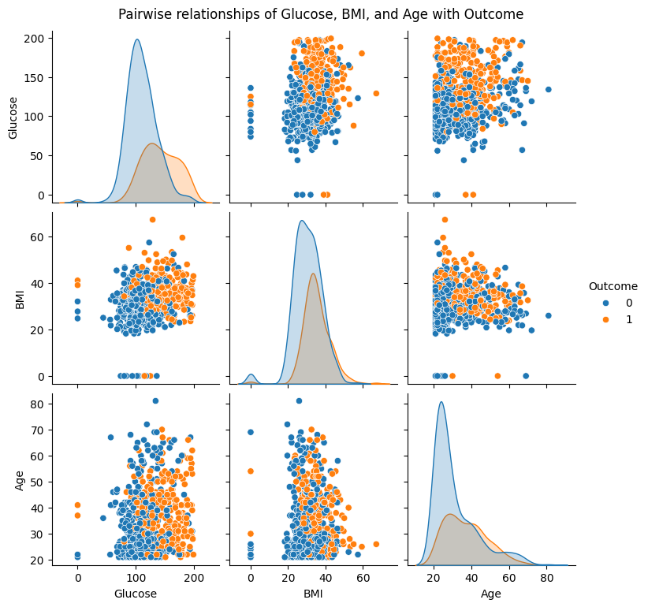
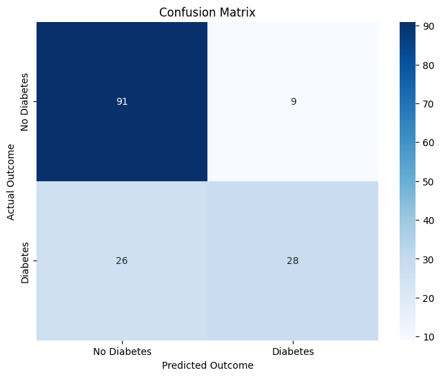

# Diabetes Prediction Machine Learning Project

## Description
This project marks my initial exploration into the field of machine learning. My objective was to develop a predictive model capable of assessing an individual's likelihood of having diabetes based on various health metrics. Utilizing a dataset containing diagnostic measurements, I engaged in data exploration, trained a classification model, and evaluated its performance. This project provided valuable insights into the end-to-end process of constructing a machine learning model, from data preparation and preprocessing to model evaluation and practical application.

## Dataset Origin
The dataset employed in this project is the [Pima Indians Diabetes Database](https://www.kaggle.com/datasets/uciml/pima-indians-diabetes-database). Originating from the National Institute of Diabetes and Digestive and Kidney Diseases, this dataset comprises health information pertaining to female patients of Pima Indian heritage, aged 21 and older. I selected this dataset as it is a widely recognized benchmark for binary classification tasks and offered an excellent opportunity to practice fundamental machine learning techniques.

## Workflow

1.  **Import Libraries**: I began by importing the necessary Python libraries essential for data manipulation, analysis, and the implementation of machine learning algorithms.
2.  **Data Pre-processing**: The diabetes dataset was then loaded into a pandas DataFrame for subsequent processing.
3.  **Data Analysis**: Initial data exploration was conducted to understand the structure and obtain basic statistics of the dataset. This involved examining the head of the DataFrame, checking its dimensions, and generating descriptive statistics.
    *   **Outcome**: The dataset includes information on 768 individuals, with 500 individuals identified as not having diabetes (Outcome 0) and 268 individuals diagnosed with diabetes (Outcome 1).
    *   **Grouped Analysis**: I grouped the data by the 'Outcome' variable and calculated the mean values of features for both the diabetic and non-diabetic groups to identify potential distinguishing characteristics.
4.  **Data Visualization**: To gain a deeper understanding of the data, I generated visualizations to explore the distribution of key features (`Glucose`, `BMI`, and `Age`) and their relationship with the 'Outcome'. Pairwise relationships between these features and the outcome were also visualized. These visualizations were instrumental in identifying potential patterns and insights.

These plots illustrate the relationships among Glucose, BMI, and Age, and how the outcome is distributed across these feature combinations. While some overlap exists, higher values in these features generally align with the diabetes outcome.
5.  **Data Standardization**: To ensure that all features contributed equally to the model training process, I standardized the features using `StandardScaler`. This step is crucial for algorithms sensitive to the scale of input data, such as SVM.
6.  **Seperating Data and Labels**: I separated the dataset into features (X) and the target variable (Y), which is the 'Outcome' column.
7.  **Train Test Split**: The data was partitioned into training and testing sets to facilitate the evaluation of the model's performance on unseen data. A stratification strategy was employed to maintain the original proportion of outcomes in both the training and testing sets, which is particularly important for imbalanced datasets.
8.  **Model Training**: A Support Vector Machine (SVM) classifier with a linear kernel was trained on the standardized training data. I opted for SVM due to its effectiveness in classification tasks, particularly when seeking a clear separation boundary between classes. The linear kernel was chosen as a foundational approach for its simplicity and interpretability.
9.  **Model Evaluation**: The performance of the trained model was assessed on both the training and testing datasets to determine its accuracy.
  
| Metric | Score |
|--------|-------|
| Training Accuracy | 78.66% |
| Testing Accuracy | 77.27% |
| Model Type | Linear SVM |

The model shows good generalization with minimal overfitting (small gap between train/test accuracy).

  
10. **Predictive System**: A simple predictive system was demonstrated using an example input to illustrate how the trained model can be applied to predict the outcome for a new individual based on their health metrics.

## What I Learned

- End-to-end ML pipeline development
- Data preprocessing and visualization techniques
- SVM implementation and evaluation
- Model performance assessment strategies
- Real-world application of predictive models

## Technologies Used

- **Python** - Core programming language
- **Pandas** - Data manipulation
- **Scikit-learn** - Machine learning algorithms
- **Matplotlib/Seaborn** - Data visualization
- **NumPy** - Numerical computations
